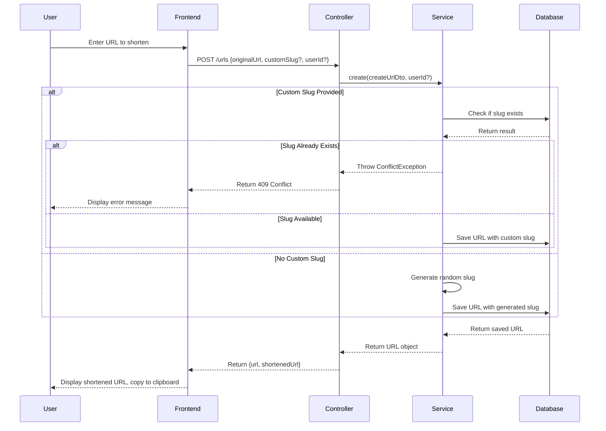
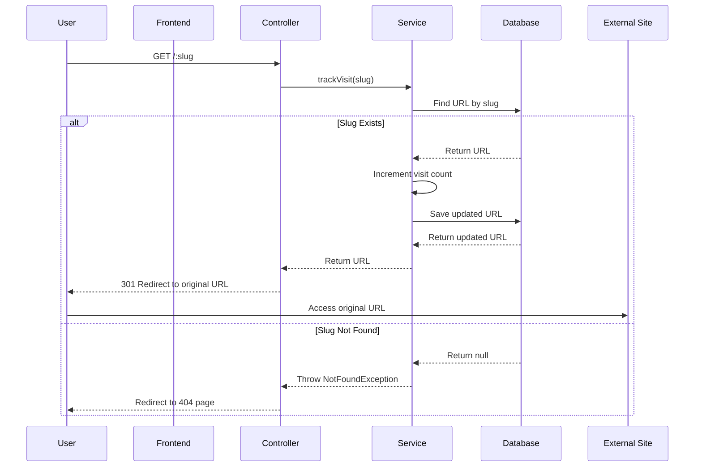
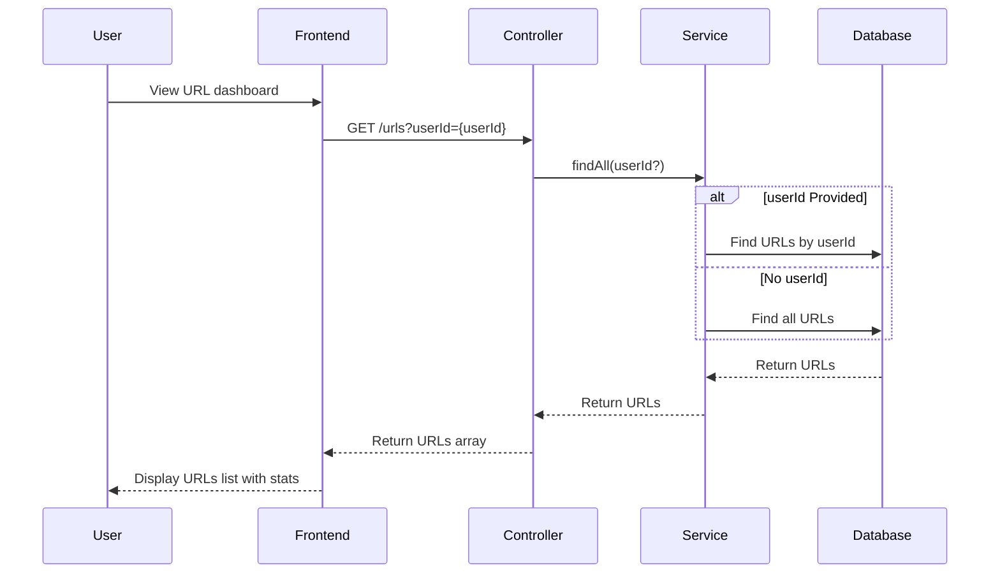

## SimpleDirectory (KittyShortener)


## Running the project

`make help` or...

```bash
make docker-build
make docker-up
# now visit localhost:3000
```

## Technologies

- TypeScript
- NodeJS | NestJS
- NextJS | HeroUI

## Workflow

### URL Creation



### Redirection




### Listing



## Coverage


## Project Improvements

- [ ] Adding real sessions
- [ ] Using network analytics instead of saving them on request
- [ ] Handle load with queues 
